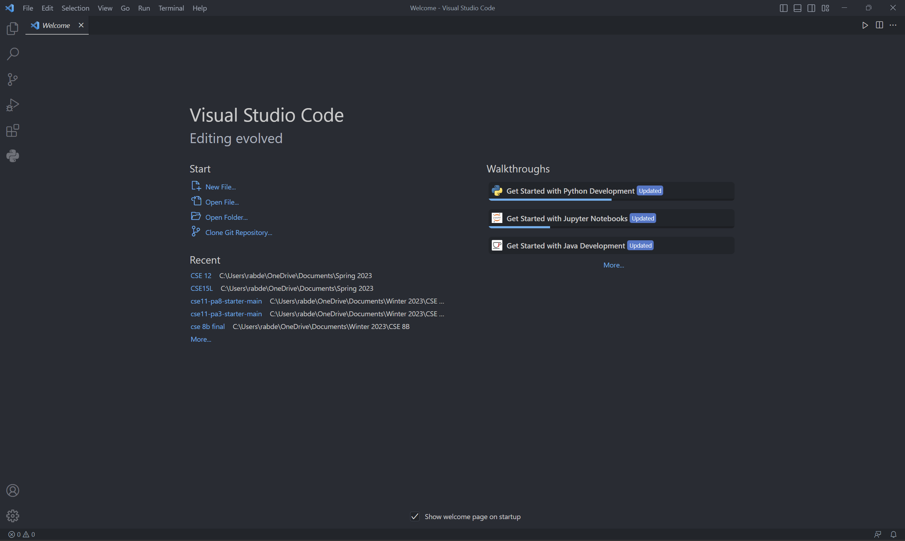

# CSE 15L Lab 1 Report

Welcome to CSE 15L. In this tutorial, you will learn how to install VSCode, how to remotely connect to a remote computer and some useful bash commands. 

## Step 1: Installing Visual Studio Code
First, go to [the official VSCode website](https://code.visualstudio.com/) and download the installer that corresponds to your operating system:

     
     
Once the installation is over, you will be greeted with a page that looks similar to the following screenshot. Note that depending on your system settings, the background color/fonts may be vary

