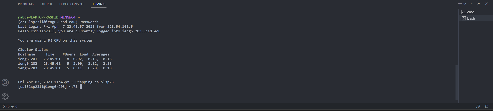

# CSE 15L Lab 1 Report

Welcome to CSE 15L. In this tutorial, you will learn how to install VSCode, how to remotely connect to a remote computer and some useful bash commands. 

## Step 1: Installing Visual Studio Code
First, go to [the official VSCode website](https://code.visualstudio.com/) and download the installer that corresponds to your operating system


     
     
Once the installation is over, you will be greeted with a page that looks similar to the following screenshot. Note that depending on your system settings, the background color/fonts may be vary


## Step 2: Setting up bash and connecting remotely using ssh (secure shell)
First, make sure that you have git installed. In Windows, a quick way of checking is by pressing Win + R to open the run tab and then typing in cmd to open the command prompt


Once the command prompt is open, type in git and hit enter. 

 If a list of commands shows up, it means that git is most likely installed in your computer. If you get anything along the lines of *'git' is not recognized as an internal or external command, operable program or batch file*, then you will have to install git.
 To install git, go to [this page](https://gitforwindows.org/) to download the installer.
 
Once git is installed in your computer, follow [this StacKOverflow post on how to use bash in the VSCode terminal.](https://gitforwindows.org/)
Now that bash is setup, you are ready to remote connect. Input ```ssh cs15lsp23zz@ieng6.ucsd.edu``` in the terminal, where the *zz* are replaced by the letters of your course account ([go to the account lookup page to setup your account](https://sdacs.ucsd.edu/~icc/index.php)). 
After this, you will be asked to input a password. This is the same password you chose when you setup your CSE 15L account


     
If all goes well after you input the password, you would see something similar to this in the terminal

This means that you are now remotely connected!

## Step 3: Running a few commands
Here are a few interesting commands to try out. For a comprehensive list, consider looking [at this website](https://www.freecodecamp.org/news/bash-scripting-tutorial-linux-shell-script-and-command-line-for-beginners/)

1) pwd. Shows the current working directory 

