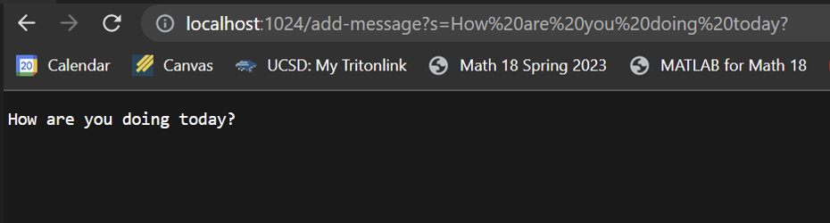
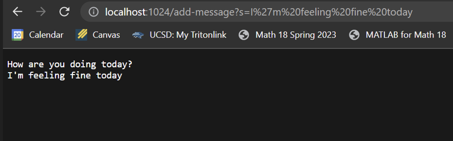
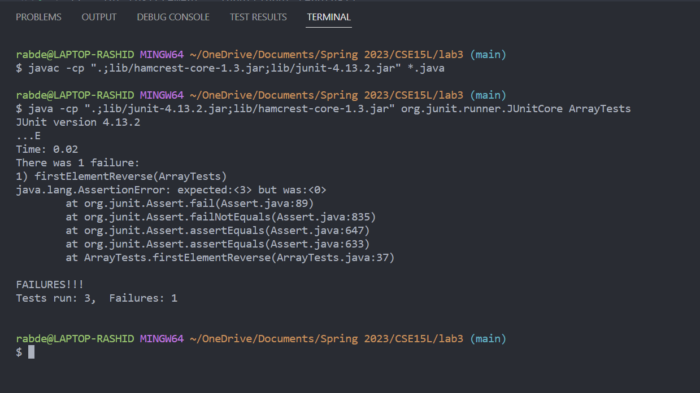

# Lab 2 Report

## 1. StringServer
Code for `StringServer.java` <br />
```Java
import java.io.IOException;
import java.net.URI;
import java.util.ArrayList;

class Handler implements URLHandler {
    // The one bit of state on the server: a number that will be manipulated by
    // various requests.
    ArrayList<String> stringlst = new ArrayList<>();
    String s1 = "";
    public String handleRequest(URI url) {
        s1 = "";
        if (url.getPath().equals("/")) {
            return String.format("String server!");
        }
        else {
            System.out.println("Path: " + url.getPath());
            if (url.getPath().contains("/add-message")) {
                String[] parameters = url.getQuery().split("=");
                String see = parameters.toString();
                System.out.println(parameters[0]);
                System.out.println(parameters[1]);
                if (parameters[0].equals("s")) {
                    stringlst.add(parameters[1]);
                    for (String s: stringlst){
                        s1 += s + "\n";
                    }
                    return String.format(s1);
                }
            }
            return "404 Not Found!";
        }
}
}

class StringServer {
    public static void main(String[] args) throws IOException {
        if(args.length == 0){
            System.out.println("Missing port number! Try any number between 1024 to 49151");
            return;
        }

        int port = Integer.parseInt(args[0]);

        Server.start(port, new Handler());
    }
}

```
<br />

- Output for `add-message?s=How are you doing today?`
 
1. For this command, we are calling the `handleRequest` method, which takes an object of type `URI` called `url`. In this case, `url` holds `http://localhost:1024/add-message?s=How are you doing today?`.
2. We initialize a string called `s1` which is initially empty (set to "") and an `ArrayList<String>` called `stringlst`.
3. Since we are inputting `add-message` as a path, the code in the `else` statement of the method runs. It checks that the path contains `/add-message` and picks the `String` that comes after `s=` by splitting the query component of `url` using `"="` as a delimiter. These strings are stored in an array called `parameters`, which has two elements: `{"s", "How are you doing today?"}`. We add the element at index 1 of `parameters` to `stringlst`.
4. Then, we loop through every element of `stringlst` to concatenate each element to `s1`. Finally, we run `String.format(s1)`, which prints the string we added and everything in `stringlst` at that point in a nice format. 


- Output for `add-message?s=I'm feeling fine today`
 <br />
The code that runs for this command is very similar to the one that ran for the previous command. 
Here are the differences:
1. `stringlst` still has our first string (`"How are you doing today"?`).
2. `url` holds `http://localhost:1024/add-message?s=I'm feeling fine today`.
3. `parameters` now stores the following elements: `{"s", "I'm feeling fine today"}`. We still add the element at index 1 to `stringlst`.
4. We concatenate every element of `stringlst` to `s1` and print the newly added string along with any other strings in the list. 


##  2. Bugs
### Test that induces a failure
``` Java
@Test 
  public void firstElementReverse() { 
    int[] input = {1, 2, 3}; 
    assertEquals(input[input.length-1], ArrayExamples.reversed(input)[0]); 
  }
  ```
### Test that doesn't induce a failure
``` Java
  @Test
  public void testReversed() {
    int[] input1 = { };
    assertArrayEquals(new int[]{ }, ArrayExamples.reversed(input1));
  }
  ```
  ### Symptoms
  
  
### Fix
- Before <br />
  ```Java
   // Returns a *new* array with all the elements of the input array in reversed
   // order
   static int[] reversed(int[] arr) {
    int[] newArray = new int[arr.length];
    for(int i = 0; i < arr.length; i += 1) {
      arr[i] = newArray[arr.length - i - 1];
    }
    return arr;
  }
  ```
- After <br />
  ```Java
  // Returns a *new* array with all the elements of the input array in reversed
  // order
  static int[] reversed(int[] arr) {
    int[] newArray = new int[arr.length];
    for(int i = 0; i < arr.length / 2; i++) {
      newArray[arr.length - i - 1] = arr[i];
    }
    return newArray;
  }
  ``` 
 <br />
 
 Our original `reverse` method had three issues:
 1. We were running the loop `n` times instead of `n/2` times (`n` is the size of the array). We need to run it `n/2` times to properly reverse the order of the elements, otherwise we are just reverting every change we make to the order of the array and end up with the same array as before
 2. We were setting the value of `arr[i]` to `newArray[arr.length - i - 1]`, when we actually want to do the opposite.
 3. We were returning `arr`, our original array, instead of `newArray`. <br /><br />
After making these corrections, `reverse` works as intended and passes the fail inducing test.
 
 ## 3. What did I learn?
 I think I got a few ideas on how to run a simple local server, and what the code for implementing web server that does interesting stuff looks like. I did not know that Java, with the help of an external package, was able to make managing a local server as simple as creating a couple of files. I'm interested in learning more about how the code in the `Server.java` works and how server implementation varies across some of the other programming languages I'm already familiar with.
