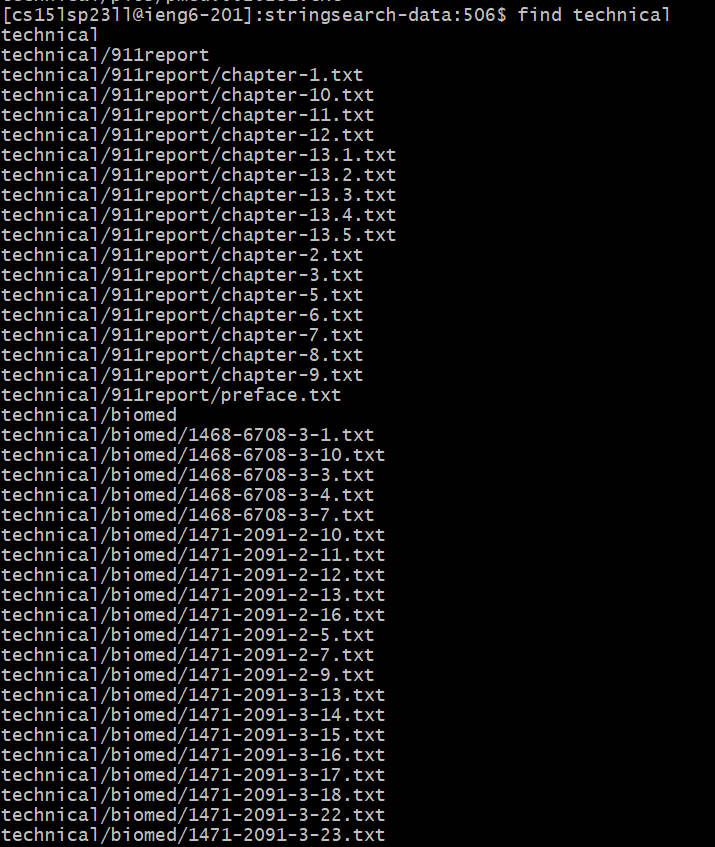
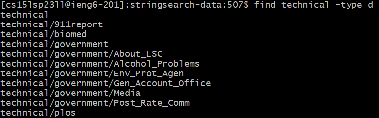
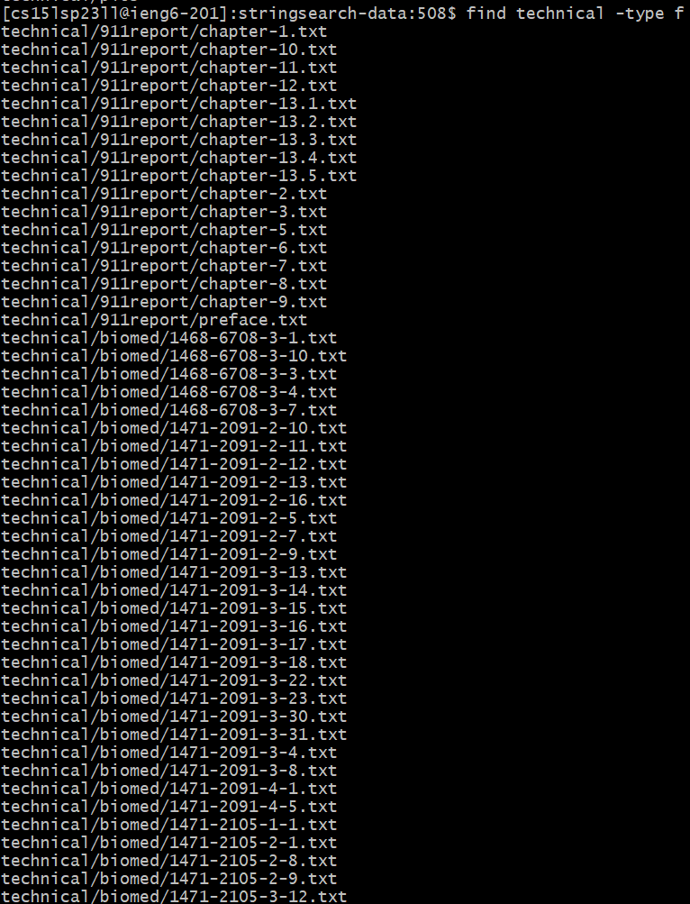
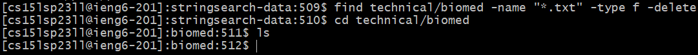
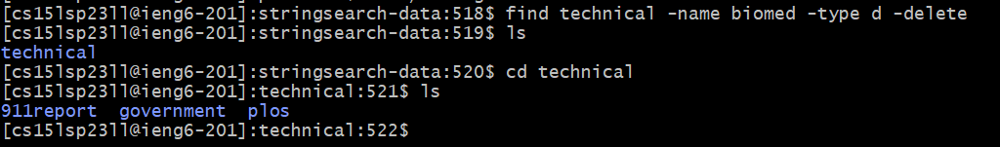
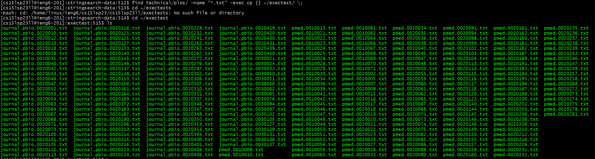
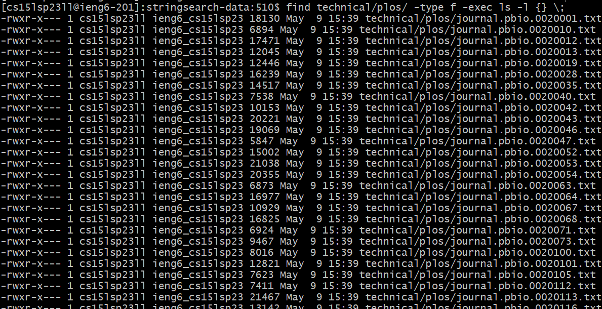

# Lab Report 3

## Researching commands: *find* and some of its options

*find* is a Linux command used for searching through file hierarchies and finding files and directories. 
This makes it a useful command, especially if you have a large number of files and nested directories and you want to find a particular file or directory with as few commands as possible.
In this lab report, I look up some of the most interesting options for *find*.

### 1. __-size__ option

This option allows us to filter the search output for files based on their size. We can use this look for files that are larger or smaller than a particular size or within a certain size range.

If we wanted to find files that matched a particular size, we would just use ```-size n```, where n is the size and its corresponding unit. Some of the most common units are:
- ```k``` for kilobytes
- ```M``` for megabytes
- ```G``` for gigabytes

For example, if we wanted to find all files that have a size of exactly 1 kilobyte in ```technical/plos/```, we would use the following command: ```find technical/plos/ -size 1k```

We would then get the following output:
 


Things look a little different when we want to find files that are within a range of sizes.
For example, we would run the following command to find all files that are between 10 bytes and 10 kilobytes in size inside of ```technical/biomed/```: 

```find technical/biomed/ -size +10b -size -10k```

Notice how the ```+``` sign before our value denotes "greater than" and the ```-``` sign denotes "less than". This is how we can bound files to be within a range of sizes.
This is the output we get after running the command: 

 


### 2. __-type__ option

__-type__ allows us to search for files and directories based on their type. This is specified by ```-type <character>```, where the character determines the file type. There are many types  we could use but I think that for now the following two are the ones I will use the most:
- ```-type f``` for files
- ```-type d``` for directories

Normally if we run find with just the directory where we want to look, we will get a mix of files and directories in our output. This is what happens when we run ```find technical```:




There is a lot more output than what is on this screenshot, but notice how we are getting directories as well as ```.txt``` files in our output. 
If we run ```find technical -type d```, we would only get an output if the result is a __directory__:




Similarly, if we run ```find technical -type f```, we would only get an output if the result is a __file__:




### 3. __-delete__ option
We can also use *find* to delete files or directories that match a particular criterion. Combining the *name*, *type* and *delete* options, we can delete files in a particular directory that match our specified extension.

For example, ```find technical/biomed -name "*.txt" -type f -delete``` would delete all the ```.txt``` files in ```technical/biomed```:




We can also use this option to delete directories. If we wanted to delete ```technical/biomed```, we would run ```find technical -name biomed -type d -delete```




### 4. -exec option
If we want to perform an action on the output we get from find, we can use the ```-exec``` option. For example, if we wanted to pick all of the .txt files of ```technical/plos``` and copy them to a folder named ```exectest``` in the root directory, we would run ```find technical/plos/ -name "*.txt" -exec cp {} ~/exectest/ \;```




You can think of the ```{}``` as a placeholder for the file that is currently being processed. The ```\;``` at the end of the command tells ```find``` to run the ```cp``` command on the file that it found and then terminate the command for that file.

Another example would be displaying all of the files in ```technical/plos/``` along with their file size, the date it was created/modified, along with some other information. We can do this by running ```find technical/plos/ -type f -exec ls -l {} \;```:



  
