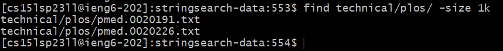
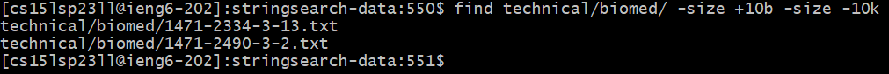

# Lab Report 3

## Researching commands: *find* and some of its options

*find* is a Linux command used for searching through file hierarchies and finding files and directories. 
This makes it a useful command, especially if you have a large number of files and nested directories and you want to find a particular file or directory with as few commands as possible.
In this lab report, I look up some of the most interesting options for *find*.

### 1. __-size__ option

This option allows us to filter the search output for files based on their size. We can use this look for files that are larger or smaller than a particular size or within a certain size range.

If we wanted to find files that matched a particular size, we would just use ```-size n```, where n is the size and its corresponding unit. Some of the most common units are:
- ```k``` for kilobytes
- ```M``` for megabytes
- ```G``` for gigabytes

For example, if we wanted to find all files that have a size of exactly 1kb in ```technical/plos/```, we would use the following command:

```find technical/plos/ -size 1k```

We would then get the following output:
 


We would run the following command to find all files that are between 10 bytes and 10 kilobytes in size inside of ```technical/biomed/```: <br /><br />
```find technical/biomed/ -size +10b -size -10k```
<br />
<br />
Notice how the ```+``` sign before our value denotes "greater than" and the ```-``` sign denotes "less than". This is how we can bound files to be within a range of sizes.
This is the output we get after running the command:
<br />
<br />
 


