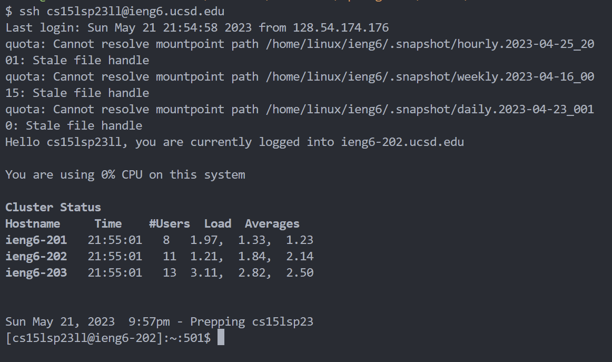
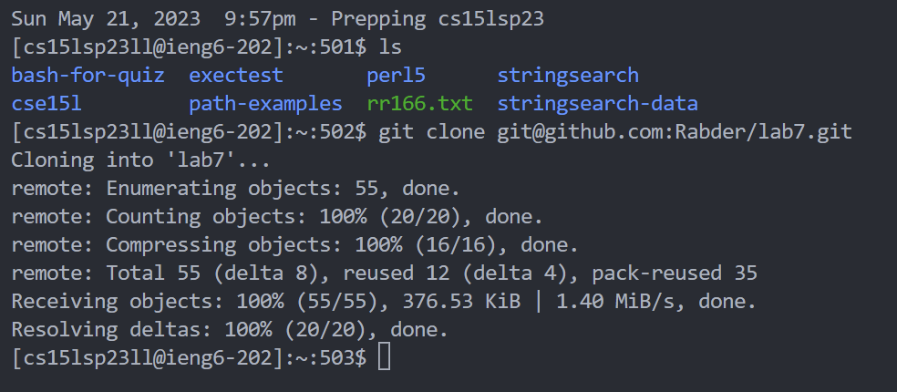
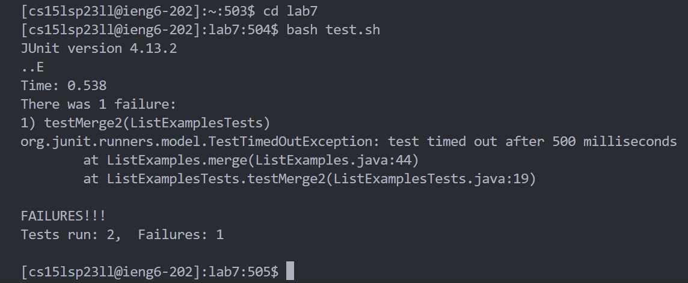
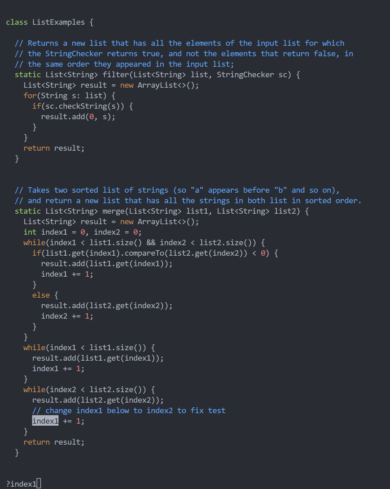
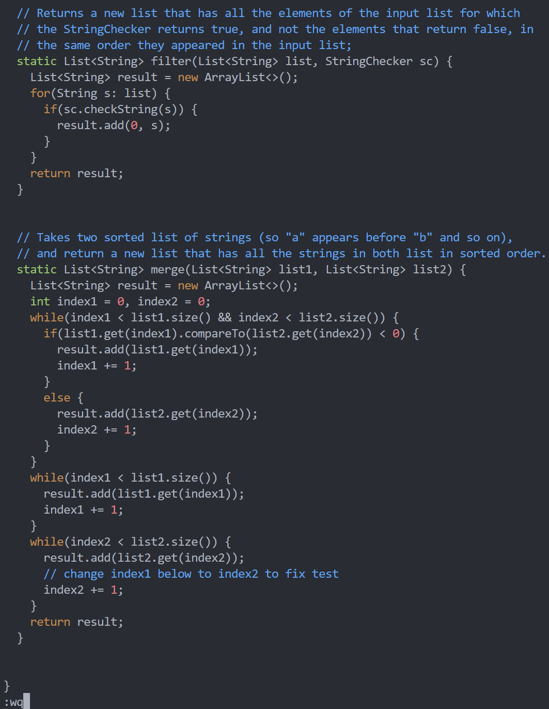
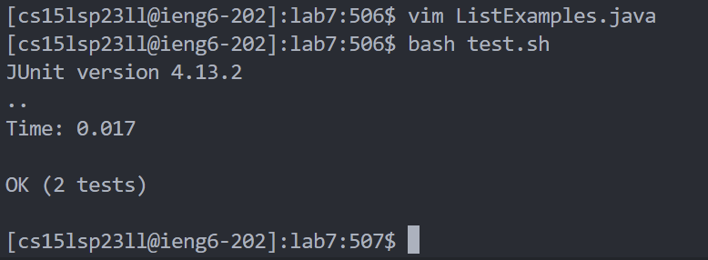
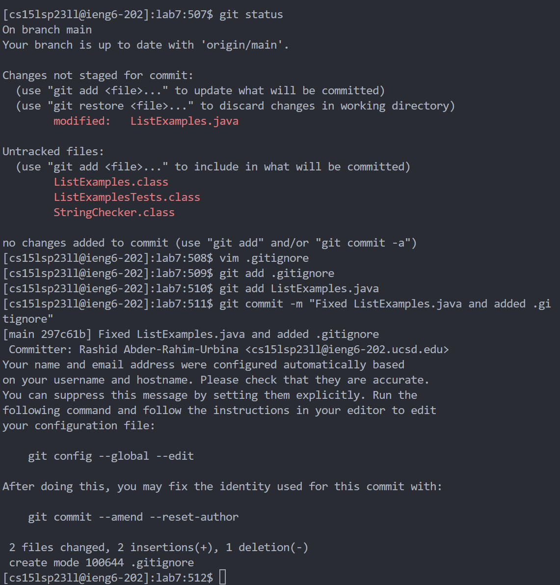
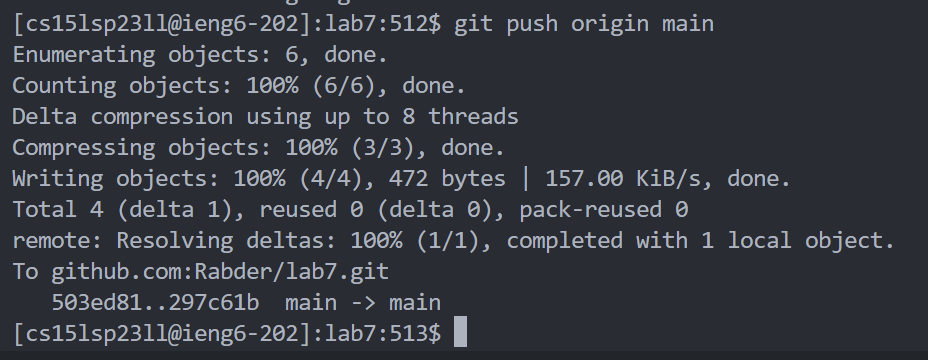

# Lab Report 4

## Step  4: Logging into ieng6
1) I opened bash, typed ```ssh cs15lsp23ll@ieng6.ucsd.edu``` and hit ```<enter>``` to log into ieng6.


## Step 5: Cloning the fork repository
1) I typed ```ls``` and hit ```<enter>``` to make sure that I didn't have the cloned repository from my previous attempts. 
2) I typed ```git clone```, copied the SSH key of the repository (```git@github.com:Rabder/lab7.git```), hit ```<CTRL> + V``` and hit ```<enter>``` to clone the repository.


## Step 6: Running test.sh to see the failing test
1) I typed ```cd lab7``` and hit ```<enter>``` to get inside the recently cloned ```lab7``` directory.
2) I typed ```bash test.sh``` and hit ```<enter>``` to run the script that runs the tests.



## Step 7: Editing ListExamples.java
1) I typed ```vim ListExamples.java``` and hit ```<enter>```. This opened the file with vim. 
2) Inside vim, I typed ```?index1``` and hit ```<enter>``` to get to ```index1``` in the file.
3) I typed ```e``` to get to just before the ```1``` of ```index1```. 
4) I typed ```x``` to remove ```1```
5) I typed ```i``` to enter Insert Mode. There I just had to type 2.
6) I hit ```<esc>```, typed ```:wq``` and hit ```<enter>``` to save the change I made.




##  Step 8: Running test.sh again
1) I hit ```<up><up>``` to get ```bash test.sh``` from my command history. I hit ```<enter>``` to run the script again.



## Step 9: Commit and push change to repository
1) Type ```git status``` + ```<enter>```.
2) Type ```vim .gitignore```, ```i```, type ```*.class```, hit ```<esc>``` and type ```:wq``` to save the file
3) Type ```git add .gitignore```, ```<enter>``` ,```git add ListExamples.java``` and ```<enter>``` to stage ```ListExamples.java``` and ```.gitignore``` for ```commit```.
4) Type ```git commit -m "Fixed ListExamples.java and added .gitignore"``` and hit ```<enter>```.



5) Type ```git push origin main``` and hit ```<enter>``` to push the changes.




