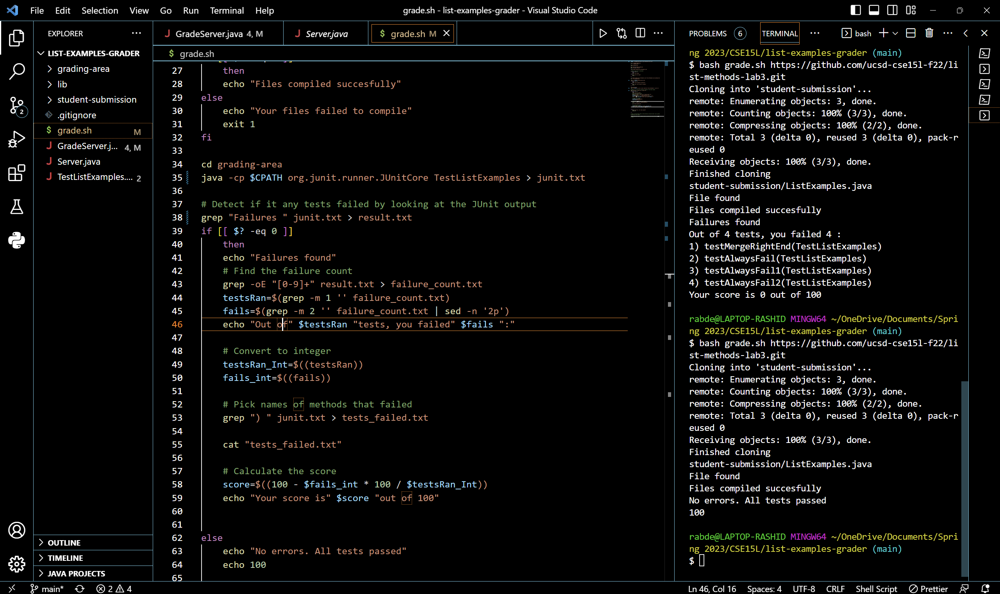
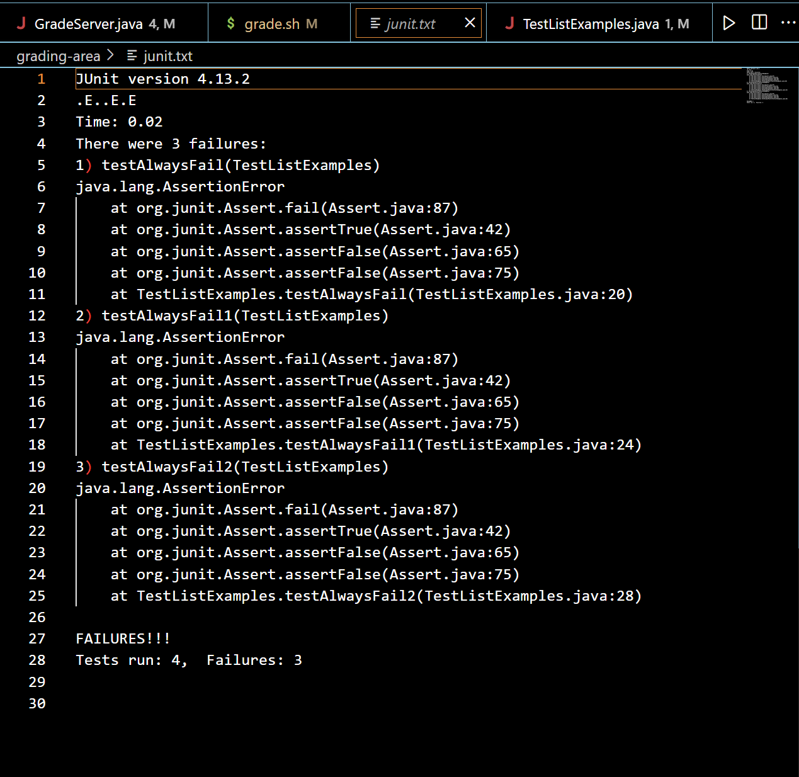
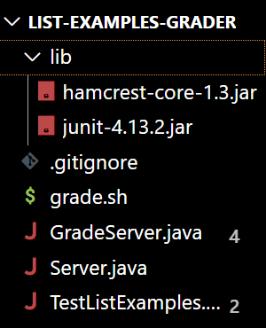

# Lab Report 5

## Student question on EdStem

>> **_What environment are you using (computer, operating system, web browser, terminal/editor, and so on)?_**  <br />
 Computer and operating system: Windows on my personal laptop. Editor: VSCode. Browser: Google Chrome. <br /> <br />
>>**_Detail the symptom you're seeing. Be specific; include both what you're seeing and what you expected to see instead. Screenshots are great, copy-pasted terminal output is also great. Avoid saying “it doesn't work”._**<br />
>>The output of grade.sh shows that every test out of the four tests passed, when three are meant to fail. <br />
>>Expected output: <br />
>>```
>>... some output ...
>>Out of 4 tests, you failed 3 :
>>1) testAlwaysFail(TestListExamples)
>>2) testAlwaysFail1(TestListExamples)        
>>3) testAlwaysFail2(TestListExamples)        
>>Your score is 25 out of 100
>>```
>>Actual output:<br />
>>
>>**_Detail the failure-inducing input and context. That might mean any or all of the command you're running, a test case, command-line arguments, working directory, even the last few commands you ran. Do your best to provide as much context as you can._** <br />
>>I'm running grade.sh with one of the sample student repositories that has bugs in it: (https://github.com/ucsd-cse15l-f22/list-methods-corrected). TestListExmples.java 
>>has 4 tests: 3 are meant to always fail and 1 is meant to always pass. My script is meant to extract the number of failing tests and the number of passing tests.
>>I'm expecting to get a message that prints that the code failed three of the tests and that the code got a score of 25 out of 100 (1/4 tests passed). 


## TA Response 
>> Hi there!
>> Based on the screenshot you provided, your issue could be related with how you parse your JUnit tests. 
>> It seems that you are storing the JUnit output in the ```junit.txt``` file. Try opening that file or running ```cat <path of junit.txt>``` to see whether the test results are being stored correctly in the file. 
 
 
## Student follow-up post
>> Ok this is what ```junit.txt``` looks like.
>>
>> I think the issue could be the way I'm checking whether the code failed any test. Instead of running ```grep "Failures " junit.txt > result.txt``` I should be running ```grep "Failures:" junit.txt > result.txt```, since that string would be in the line that would tell me how many tests failed. There is no "Failures " string in the text file, which is probably why it didn't report any errors.
 
 
 ## Setup for reproducing this problem
 1. Clone this repository: https://github.com/Rabder/list-examples-grader.git. This is the grading script my lab partner and I wrote during lab.
 2. The file hierarchy should look like this: <br />
 
 
 ### Contents of each file (before fixing the bug)
 - GradeServer.java
 ```java
 import java.io.BufferedReader;
import java.io.IOException;
import java.io.InputStream;
import java.io.InputStreamReader;
import java.net.URI;
import java.net.URISyntaxException;
import java.util.Arrays;
import java.util.stream.Stream;

class ExecHelpers {

  /**
    Takes an input stream, reads the full stream, and returns the result as a
    string.

    In Java 9 and later, new String(out.readAllBytes()) would be a better
    option, but using Java 8 for compatibility with ieng6.
  */
  static String streamToString(InputStream out) throws IOException {
    String result = "";
    while(true) {
      int c = out.read();
      if(c == -1) { break; }
      result += (char)c;
    }
    return result;
  }

  /**
    Takes a command, represented as an array of strings as it would by typed at
    the command line, runs it, and returns its combined stdout and stderr as a
    string.
  */
  static String exec(String[] cmd) throws IOException {
    Process p = new ProcessBuilder()
                    .command(Arrays.asList(cmd))
                    .redirectErrorStream(true)
                    .start();
    InputStream outputOfBash = p.getInputStream();
    return String.format("%s\n", streamToString(outputOfBash));
  }

}

class Handler implements URLHandler {
    public String handleRequest(URI url) throws IOException {
       if (url.getPath().equals("/grade")) {
           String[] parameters = url.getQuery().split("=");
           if (parameters[0].equals("repo")) {
               String[] cmd = {"bash", "grade.sh", parameters[1]};
               String result = ExecHelpers.exec(cmd);
               return result;
           }
           else {
               return "Couldn't find query parameter repo";
           }
       }
       else {
           return "Don't know how to handle that path!";
       }
    }
}

class GradeServer {
    public static void main(String[] args) throws IOException {
        if(args.length == 0){
            System.out.println("Missing port number! Try any number between 1024 to 49151");
            return;
        }

        int port = Integer.parseInt(args[0]);

        Server.start(port, new Handler());
    }
}

class ExecExamples {
  public static void main(String[] args) throws IOException {
    String[] cmd1 = {"ls", "lib"};
    System.out.println(ExecHelpers.exec(cmd1));

    String[] cmd2 = {"pwd"};
    System.out.println(ExecHelpers.exec(cmd2));

    String[] cmd3 = {"touch", "a-new-file.txt"};
    System.out.println(ExecHelpers.exec(cmd3));
  }
}
```
- Server.java
 ```// A simple web server using Java's built-in HttpServer

// Examples from https://dzone.com/articles/simple-http-server-in-java were useful references

import java.io.IOException;
import java.io.OutputStream;
import java.net.InetAddress;
import java.net.InetSocketAddress;
import java.net.URI;

import com.sun.net.httpserver.HttpExchange;
import com.sun.net.httpserver.HttpHandler;
import com.sun.net.httpserver.HttpServer;

interface URLHandler {
    String handleRequest(URI url) throws IOException;
}

class ServerHttpHandler implements HttpHandler {
    URLHandler handler;
    ServerHttpHandler(URLHandler handler) {
      this.handler = handler;
    }
    public void handle(final HttpExchange exchange) throws IOException {
        // form return body after being handled by program
        try {
            String ret = handler.handleRequest(exchange.getRequestURI());
            // form the return string and write it on the browser
            exchange.sendResponseHeaders(200, ret.getBytes().length);
            OutputStream os = exchange.getResponseBody();
            os.write(ret.getBytes());
            os.close();
        } catch(Exception e) {
            String response = e.toString();
            exchange.sendResponseHeaders(500, response.getBytes().length);
            OutputStream os = exchange.getResponseBody();
            os.write(response.getBytes());
            os.close();
        }
    }
}

public class Server {
    public static void start(int port, URLHandler handler) throws IOException {
        HttpServer server = HttpServer.create(new InetSocketAddress(port), 0);

        //create request entrypoint
        server.createContext("/", new ServerHttpHandler(handler));

        //start the server
        server.start();
        System.out.println("Server started at http://" + InetAddress.getLocalHost().getHostName() + ":" + port);
        System.out.println("(Or, if it's running locally on this computer, use http://localhost:" + port + " )");
    }
}
```
- TestListExamples.java
 ``` import static org.junit.Assert.*;
import org.junit.*;
import java.util.Arrays;
import java.util.List;

class IsMoon implements StringChecker {
  public boolean checkString(String s) {
    return s.equalsIgnoreCase("moon");
  }
}

public class TestListExamples {
  @Test(timeout = 500)
  public void testMergeRightEnd() {
    List<String> left = Arrays.asList("a", "b", "c");
    List<String> right = Arrays.asList("a", "d");
    List<String> merged = ListExamples.merge(left, right);
    List<String> expected = Arrays.asList("a", "a", "b", "c", "d");
    assertEquals(expected, merged);
  }

  @Test
  public void testAlwaysFail(){
    assertFalse(true);
  }
  @Test
  public void testAlwaysFail1(){
    assertFalse(true);
  }
  @Test
  public void testAlwaysFail2(){
    assertFalse(true);
  }


}
```
- grade.sh
 ```
 CPATH='.;lib/hamcrest-core-1.3.jar;lib/junit-4.13.2.jar'
 
rm -rf student-submission
rm -rf grading-area

mkdir grading-area

git clone $1 student-submission
echo 'Finished cloning'

find student-submission/ListExamples.java

# Check if the file is available
if [[ $? -eq 0 ]]
    then 
    echo "File found"
else  
    echo "File not found"
    exit 1
fi

cp student-submission/ListExamples.java TestListExamples.java grading-area
cp -r lib grading-area

javac -cp $CPATH grading-area/*.java
if [[ $? -eq 0 ]]
    then 
    echo "Files compiled succesfully"
else
    echo "Your files failed to compile"
    exit 1
fi

cd grading-area
java -cp $CPATH org.junit.runner.JUnitCore TestListExamples > junit.txt

# Detect if it any tests failed by looking at the JUnit output
grep "Failures " junit.txt > result.txt
if [[ $? -eq 0 ]]
    then
    echo "Failures found"
    # Find the failure count
    grep -oE "[0-9]+" result.txt > failure_count.txt
    testsRan=$(grep -m 1 '' failure_count.txt)
    fails=$(grep -m 2 '' failure_count.txt | sed -n '2p')
    echo "Out of" $testsRan "tests, you failed" $fails ":"

    # Convert to integer
    testsRan_Int=$((testsRan))
    fails_int=$((fails))

    # Pick names of methods that failed 
    grep ") " junit.txt > tests_failed.txt

    cat "tests_failed.txt"

    # Calculate the score
    score=$((100 - $fails_int * 100 / $testsRan_Int))
    echo "Your score is" $score "out of 100"


else
    echo "No errors. All tests passed"
    echo 100

fi

# Draw a picture/take notes on the directory structure that's set up after
# getting to this point

# Then, add here code to compile and run, and do any post-processing of the
# tests
 ```
 
- .gitignore
 
 ``` 
 *.class
grading-area/*
```
 
The ```lib``` folder contains the ```.jar``` files ```hamcrest-core-1.3.jar``` and ```junit-4.13.2.jar```, which are needed to run the JUnit tests in ```TestListExamples.java```.
 
 ### Command lines ran
 1. ```bash grade.sh https://github.com/ucsd-cse15l-f22/list-methods-corrected```. This command runs the grading script for this repository and should give the same output as the one in the student's screenshot.
 
### Fixing the bug
 The JUnit output has a line that tells you how many tests were ran and how many failed.
 
 If any test fails, it would look something like this:
 ```
 ...
Tests run: 4,  Failures: 4
 ...
 ```
If no tests failed, it would look like this:
 ```
 ...
 OK (4 tests)
 ...
 ```
The bug can be fixed by changing the pattern passed into grep when looking for any failing tests in the JUnit output. Since there is no line that contains the string ```Failures ``` (note the space) whether there are failing tests or not, ```result.txt``` will always we empty. Since we rely on what is stored in ```result.txt``` to get the failure count, the script will never find failing tests.
We want this particular line of the output, so instead of running ```grep "Failures " junit.txt > result.txt``` we would run ```grep "Failures:" junit.txt > result.txt```. 
 
 Fixed code in grade.sh (Line 38):  
```
 ...
grep "Failures:" junit.txt > result.txt
 ...
```
 
